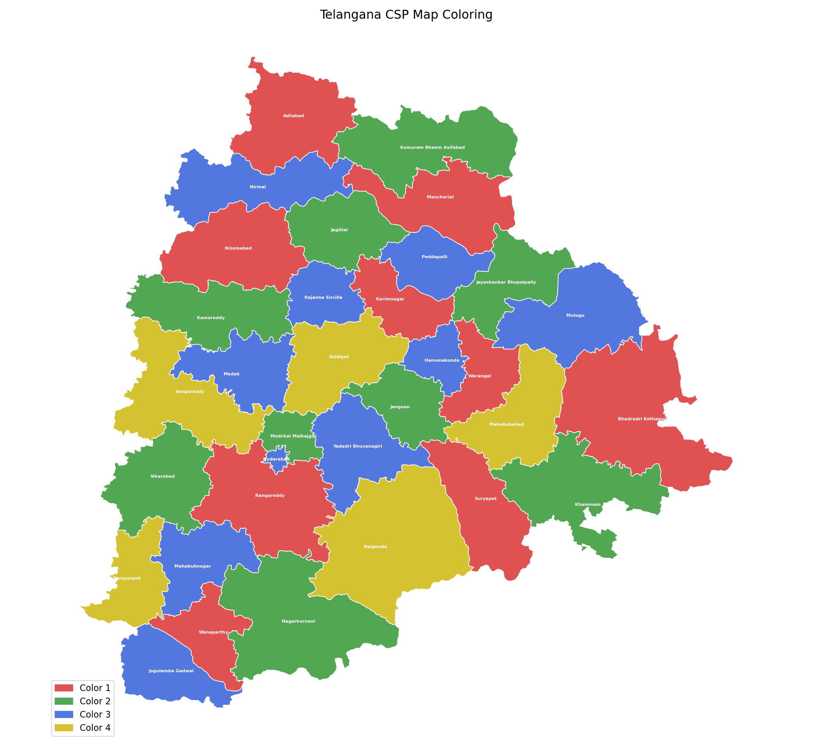

#  AI Assignments 4 – Constraint Satisfaction Problems (CSP)

This repository contains implementations of **Constraint Satisfaction Problems (CSP)** using a common reusable backtracking solver in Python.

---

##  Overview

A **Constraint Satisfaction Problem (CSP)** is defined by:
- **Variables**
- **Domains** (possible values)
- **Constraints** (rules restricting assignments)

This project demonstrates how a single CSP framework can be applied to solve multiple real-world problems.

---

##  Implemented Problems

###  1. Sudoku Solver
- Solves a standard 9×9 Sudoku puzzle
- Constraints:
  - Each row, column, and 3×3 box must contain unique numbers (1–9)
- Approach:
  - Variables: Grid cells `(row, col)`
  - Domains: `{1–9}`
  - Constraints handled via neighbor relationships

---

###  2. Australia Map Coloring
- Assign colors to regions such that no adjacent regions share the same color
- Constraints:
  - Neighboring states must have different colors
- Colors used: Red, Green, Blue

---

###  3. Telangana Map Coloring
- Similar to Australia map coloring but applied to Telangana districts
- Includes:
  - Real geographic visualization using GeoJSON
  - Matplotlib-based colored map output
- Constraints:
  - Adjacent districts must have different colors

---

## Telangana Map Output

CSP-based map coloring of Telangana districts:

  

---

###  4. Cryptarithm Solver (TWO + TWO = FOUR)
- Solves a classic cryptarithmetic puzzle
- Each letter represents a unique digit (0–9)

#### Constraints:
- All letters must have different digits
- Leading digits cannot be zero
- Arithmetic constraints with carry handling:

  T W O
+ T W O
F O U R
---

- Approach:
- Variables: Letters + carry variables
- Custom constraint function for arithmetic validation

---

##  CSP Framework

The core CSP solver is based on:

- **Backtracking Search**
- **MRV (Minimum Remaining Values) heuristic**
- **Consistency checking using neighbors**
- **Custom constraint support (for cryptarithm)**

---

## ▶️ How to Run

### 1. Clone the repository

**git clone https://github.com/adarsh684/AI-assignments-4.git**
**cd AI-assignments-4**

### 2. Running any file

#### Australia Map:
python3 Australia-CSP.py

#### Telangana Map:
python3 Telangana-CSP.py

#### Sudoku:
python3 sudoku-CSP.py

#### Crypt Analysis Puzzle:
python3 crypt-analysis-CSP.py

#### Install required libraries:
pip install matplotlib numpy

